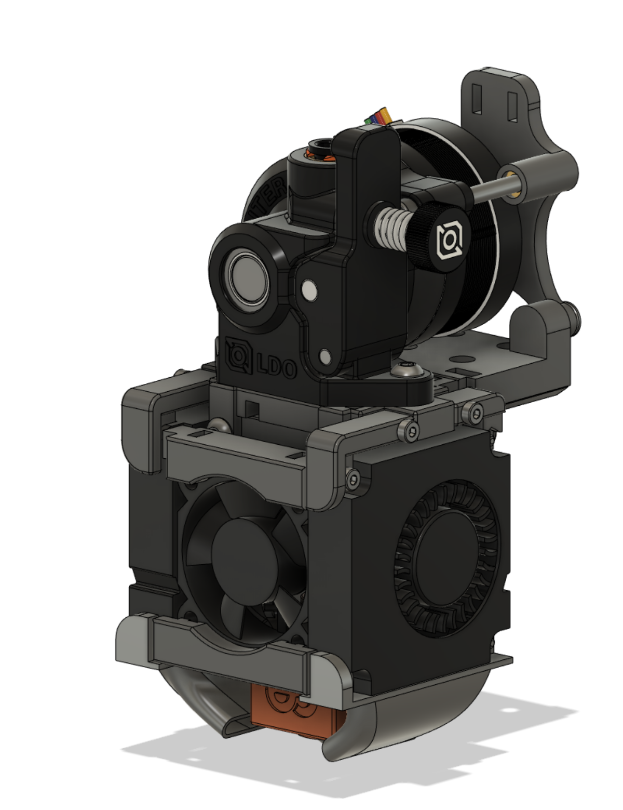

# Voron0-O2Flow-Toolhead

## Highlights
- 2x 4010 blower fans for increased part cooling performance
- compatible with original Voron 0.2 hotend mounts
- easy maintenance due to screw-together-design

## Important notes
Due to the larger fans, you lose roughly 10mm of buildarea in Y direction, resulting in (XYZ) 120mm x 110mm x 120mm

# Instructions

## Printing
Use the default Voron 0.2 printing settings.
|Settings|Value|
|---|---|
|Wall count|4|
|Top/Bottom Layers|5|
|Layer Height|0.2mm|
|Material|ABS/ASA|
|Infill|40%|

Parts starting with **V0_S_** need support for printing.
You need to print one piece of every part.

## Assembly
Please refer to the .STEP assembly.